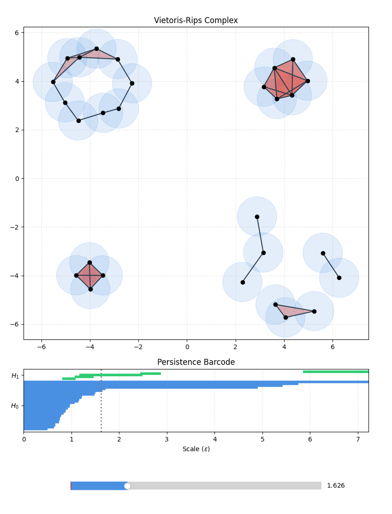
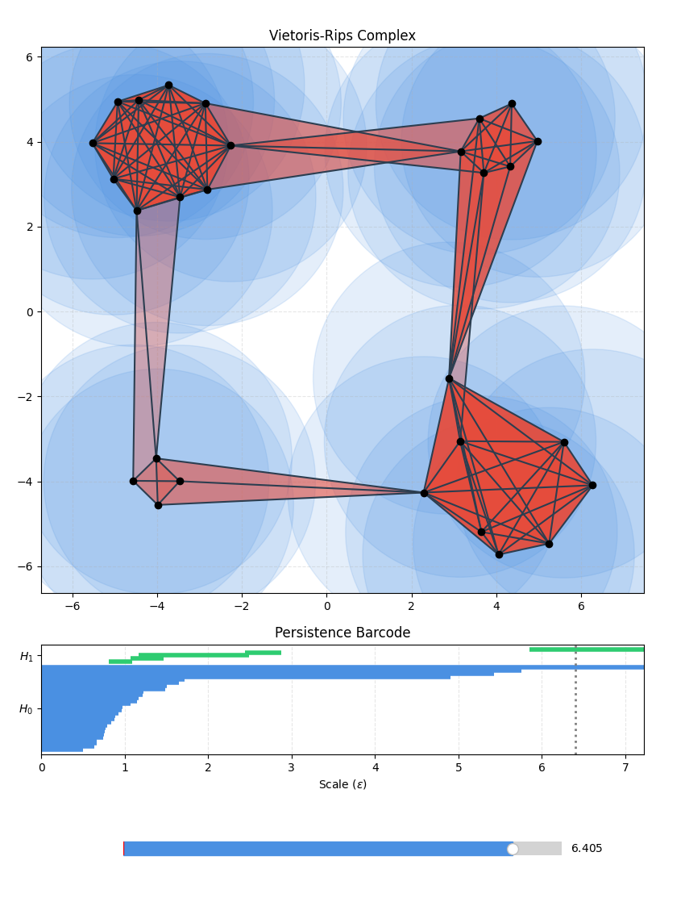

# Quantum Topological Data Analysis and Persistent Homology

This repository implements algorithms from classical and quantum topological data analysis. Implementations are for learning purposes, not efficiency.

**Classical Topological Data Analysis:** Starting from a point cloud, we construct a
Vietoris-Rips complex and the corresponding persistent homology, which give us the persistence
barcode. We also compute Betti numbers using the combinatorial Hodge-Laplacian, for comparison with the quantum approach.

**Quantum Topological Data Analysis:** We follow the main steps of the original [LGZ algorithm](https://arxiv.org/abs/1408.3106), and implement and simulate the circuit in [pytket](https://docs.quantinuum.com/tket/api-docs/). The algorithm involves amplitude amplification, Trotterized evolution of the Hodge-Laplacian, and Quantum Phase Estimation.

All classical and quantum-algorithm components are implemented for clarity, not optimized in any way.

## Contents

- [Contents](#contents)
- [Running the examples](#running-the-examples)
- [Classical Topological Data Analysis](#classical-topological-data-analysis)
  - [Persistent Homology](#persistent-homology)
  - [Combinatorial Hodge-Laplacian](#combinatorial-hodge-laplacian)
- [Quantum Topological Data Analysis](#quantum-topological-data-analysis)
  - [Simplex Encoding](#simplex-encoding)
  - [Main idea of the quantum algorithm](#main-idea-of-the-quantum-algorithm)
  - [Step one: Preparing the Simplex Mixture](#step-one-preparing-the-simplex-mixture)
  - [Step two: Quantum Phase Estimation](#step-two-quantum-phase-estimation)

## Running the examples

Install the numerical, plotting, and pytket/Qiskit dependencies:

~~~bash
python -m pip install numpy scipy matplotlib pytket-qiskit qiskit-aer
~~~

Run the examples as modules from the repository root folder.

The persistent-homology script computes the persistence barcode:

~~~bash
# Persistent homology over F_2 and an interactive barcode plot
python -m scripts.persistent_homology_barcode
~~~

  
  

The Hodge-Laplacian script computes harmonic cycles and Betti numbers at different scales:

~~~bash
# Classical Hodge-Laplacian calculation at fixed scales
python -m scripts.classical_hodge_laplacian_betti
~~~

<!-- ~~~text
beta_1 = dim ker(L_1) = 2

zero mode 1 in the C_1(K_epsilon) basis
mode = -0.008|(3, 4)> +0.249|(14, 15)> -0.024|(8, 9)> -0.008|(2, 3)> +0.499|(11, 12)> -0.499|(10, 15)> +0.249|(12, 13)> -0.024|(6, 7)> -0.024|(1, 2)> -0.024|(5, 6)> +0.499|(10, 11)> -0.024|(7, 8)> -0.024|(4, 5)> -0.024|(0, 1)> +0.024|(0, 9)> +0.249|(13, 15)> -0.016|(2, 4)> +0.249|(12, 14)>

zero mode 2 in the C_1(K_epsilon) basis
mode = -0.113|(3, 4)> -0.018|(14, 15)> -0.339|(8, 9)> -0.113|(2, 3)> -0.036|(11, 12)> +0.036|(10, 15)> -0.018|(12, 13)> -0.339|(6, 7)> -0.339|(1, 2)> -0.339|(5, 6)> -0.036|(10, 11)> -0.339|(7, 8)> -0.339|(4, 5)> -0.339|(0, 1)> +0.339|(0, 9)> -0.018|(13, 15)> -0.226|(2, 4)> -0.018|(12, 14)>

epsilon -> beta_1(K_epsilon) = dim ker L_1(K_epsilon)

   epsilon   beta_1
--------------------
  0.000000        0
  1.067461        1
  1.172352        2
  1.469419        1
  2.486905        0
~~~ -->

The QTDA script estimates Betti numbers from a simulated quantum circuit following the LGZ algorithm:

~~~bash
# QTDA Betti-number estimate with amplitude amplification, Trotterization, and QPE
python -m scripts.qtda_betti_estimation
~~~

~~~text
--- Vietoris-Rips complex ---
1-simplices at radius epsilon = 1.1
C_1(K_epsilon) = [(0, 1), (0, 3), (1, 2), (2, 3)]

--- Quantum registers ---
S: 6 qubits  (simplex label)
R: 6 qubits  (reference register)
P: 3 qubits  (QPE phase register)
total: 15 qubits

--- Amplitude amplification ---
initial good probability = |C_1| / C(6, 2) = 4 / 15 = 0.2667
AA iterations = 1

--- L_1,S evolution ---
number of Pauli terms in L_1,S = 48

--- Result ---
P(phase = 0) = 0.2528
quantum beta_1 = |C_1| P(phase = 0) = 1.0112
classical beta_1 = dim ker L_1 = 1
~~~

## Classical Topological Data Analysis

### Persistent Homology

We start from a point cloud from a dataset

$$
X=\{x_0,\ldots,x_{n-1}\}\subset\mathbb{R}^d.
$$

At scale $\epsilon$, the Vietoris-Rips complex contains every simplex whose
points are pairwise within distance $\epsilon$:

$$
K_\epsilon=
\{
\sigma\subseteq X \;\big|\;
d(x,y)\leq\epsilon,
\quad \forall x,y\in\sigma
\}.
$$

As $\epsilon$ increases, simplices are added but never removed, giving rise to a filtration $K_{\epsilon_0}\subseteq \cdots \subseteq K_{\epsilon_m}$.

A $p$-simplex $\sigma=[v_0,\ldots,v_p]\in K_\epsilon$ contains $p+1$
vertices: a vertex is a 0-simplex, an edge is a 1-simplex, and a triangle is a 2-simplex.
The $p$-chain group is the $\mathbb F$-vector space spanned by the $p$-simplices: $C_p(K_\epsilon)=\mathrm{span}_{\mathbb{F}}\{[v_0,\ldots,v_p]\in K_\epsilon\}$, with the boundary map $\partial_p:C_p\rightarrow C_{p-1}$

$$
\partial_p[v_0,\ldots,v_p]
=\sum_{r=0}^{p}(-1)^r
[v_0,\ldots,v_{r-1},v_{r+1},\ldots,v_p].
$$

The $p$-th homology group is $H_p(K_\epsilon)=\ker\partial_p / \mathrm{im}\,\partial_{p+1}$ and its dimension is the $p$-th Betti number $\beta_p^{(\epsilon)}=\dim H_p(K_\epsilon)$.

The inclusion $\iota:K_{\epsilon_i}\hookrightarrow K_{\epsilon_j}$ induces a linear
map on homology,
$\iota_*:H_p(K_{\epsilon_i})\rightarrow H_p(K_{\epsilon_j})$. We can therefore
follow homology classes across the filtration: classes are born when they first
appear and die when they become trivial at a later scale.

The persistent homology group is
$H_p^{i\to j}=\mathrm{im}(\iota^{i\to j}_*)$, containing classes present at scale
$\epsilon_i$ that survive to $\epsilon_j$. Its dimension,

$$\beta_p^{i\to j}=\dim H_p^{i\to j},$$

is the **persistent Betti number**.

#### Computing Persistent Homology
We use the standard reduction algorithm of [Zomorodian and Carlsson, *Computing Persistent Homology*](https://doi.org/10.1007/s00454-004-1146-y).

For computing persistent Betti numbers it's simplest to work over $\mathbb F = \mathbb F_2$. Define the $n\times n$ global boundary matrix $D$ by $D_{ij} = \langle\sigma_i, \partial\sigma_j\rangle$. Over $\mathbb F_2$, this becomes

$$
D_{ij}=
\begin{cases}
1, & \sigma_i\text{ is a codimension-one face of }\sigma_j,\\
0, & \text{otherwise.}
\end{cases}
$$

For persistent homology, we need to keep track of the distance at which each simplex enters the Vietoris-Rips complex. In the code we track this using

~~~python
FilteredSimplex(vertices=(0, 1, 3), distance=1.42)
~~~

We order the simplices in the order they appear in the complex: $\sigma_0,\sigma_1,\ldots,\sigma_m$. This gives a filtration $K_0\subseteq\cdots\subseteq K_m$, where one new simplex is
added at each step. In this basis:

$$
D=
\begin{array}{cc}
&
\begin{array}{ccccc}
\sigma_0 & \sigma_1 & \sigma_2 & \cdots & \sigma_m
\end{array}
\\
\begin{array}{c}
\sigma_0\\
\sigma_1\\
\sigma_2\\
\vdots\\
\sigma_m
\end{array}
&
\begin{pmatrix}
0 & * & * & \cdots & *\\
0 & 0 & * & \cdots & *\\
0 & 0 & 0 & \cdots & *\\
\vdots & \vdots & \vdots & \ddots & \vdots\\
0 & 0 & 0 & \cdots & 0
\end{pmatrix}
\end{array}.
$$

We reduce the columns from left to right. If the lowest $1$ in column $j$
matches that of an earlier column $k<j$, we add the earlier column:

$$
R_j \leftarrow R_j + R_k,\qquad k<j.
$$

This is addition modulo $2$, so it cancels the shared lowest $1$. We only use
earlier columns: they correspond to simplices already present when
$\sigma_j$ enters the filtration. A zero reduced column creates a homology
class; otherwise, its lowest $1$ identifies the earlier simplex whose class
is killed by $\sigma_j$. These birth--death pairs form the persistence
barcode.

### Combinatorial Hodge-Laplacian

For the Hodge-Laplacian and the quantum algorithm, we use real chain spaces ($\mathbb F=\mathbb R$)
with oriented simplices as an orthonormal basis. At a fixed scale $\epsilon$,
the $p$-th combinatorial Hodge-Laplacian is

$$
L_p
=\partial_p^\dagger\partial_p
+\partial_{p+1}\partial_{p+1}^\dagger,
\qquad
L_p:C_p\rightarrow C_p.
$$

The vectors in $\ker L_p$ are the
harmonic $p$-chains and are unique representatives of homology classes. Hodge theory gives

$$
\ker L_p\cong H_p(K_\epsilon),
\qquad
\beta_p^{(\epsilon)}=\dim\ker L_p.
$$

A useful operator in the quantum algorithm is the Dirac operator that
combines all boundary maps into one Hermitian operator on the graded chain
space $C=\bigoplus_p C_p$: $B=\partial+\partial^\dagger$.

$$
B=
\begin{pmatrix}
 & \partial_1 &  &  &  \\
\partial_1^\dagger &  & \partial_2 &  &  \\
 & \partial_2^\dagger &  & \ddots &  \\
 &  & \ddots &  & \partial_n \\
 &  &  & \partial_n^\dagger &
\end{pmatrix}.
$$

Because $\partial^2=0$, its square is block diagonal, $B^2=\bigoplus_p L_p$.

If we are interested only in $L_p$, we only need the part of $B$ acting on
$C_{p-1}\oplus C_p\oplus C_{p+1}$:

$$
B_p=
\begin{pmatrix}
0 & \partial_p & 0\\
\partial_p^\dagger & 0 & \partial_{p+1}\\
0 & \partial_{p+1}^\dagger & 0
\end{pmatrix}.
$$

Then its square restricted to $C_p$ is the Hodge-Laplacian,

$$
B_p^2|_{C_p}=L_p.
$$

## Quantum Topological Data Analysis

### Simplex Encoding

Label the $n$ data points as $x_0,\ldots,x_{n-1}$ and use one qubit for each
point. A simplex $\sigma\subseteq X$ is encoded by its vertex bit string:

$$
|\sigma\rangle=|z_0z_1\ldots z_{n-1}\rangle,
\qquad
z_i=
\begin{cases}
1, & x_i\in\sigma,\\
0, & x_i\notin\sigma.
\end{cases}
$$

A $p$-simplex has $p+1$ vertices, so its state has Hamming weight $p+1$. The
$n$-qubit Hilbert space decomposes into fixed-Hamming-weight
subspaces:

$$
\mathcal H=\bigoplus_p \mathcal H_p,
\qquad
\mathcal H_p
=\mathrm{span}\{
|z\rangle:|z|=p+1
\}.
$$

At scale $\epsilon$, only
the $p$-simplices in $K_\epsilon$ are valid. They span the simplicial
subspace

$$
\mathcal H_{C_p}
=\mathrm{span}\{
|\sigma\rangle:\sigma\in C_p(K_\epsilon)
\}
\subseteq\mathcal H_p,
\qquad
\dim\mathcal H_{C_p}=|C_p(K_\epsilon)|.
$$

### Main idea of the quantum algorithm
The goal is to estimate the dimension of the harmonic subspace,
$\dim\ker L_p=\beta_p$. First, construct the uniform mixed state over the
valid $p$-simplices:

$$
\rho_p
=\frac{1}{|C_p|}
\sum_{\sigma\in C_p}
|\sigma\rangle\langle\sigma|
=\frac{\Pi_{C_p}}{|C_p|},
$$

where $\Pi_{C_p}$ is the projector onto $\mathcal H_{C_p}$. We then use QPE
with the Hermitian $B_p$. Measuring the phase register decomposes the state
into its eigenspaces; on $\mathcal H_{C_p}$, the zero eigenspace is the
harmonic subspace $\ker L_p$.

If $\Pi_{\mathrm{harm},p}$ projects onto this subspace, the probability of a
zero-phase result is

$$
\Pr(\phi=0)
=\mathrm{Tr}(\Pi_{\mathrm{harm},p}\rho_p)
=\frac{\beta_p}{|C_p|}.
$$

Thus, from $N$ QPE measurements with $N_0$ zero-phase outcomes,

$$
\beta_p\approx|C_p|\frac{N_0}{N}.
$$

### Step one: Preparing the Simplex Mixture

We construct $\rho_p$ in three steps.

1. **Prepare the Dicke state.** The circuit $A$ prepares the uniform
   Hamming-weight-$p+1$ state

   $$
   A|0\cdots0\rangle=|u_p\rangle
   =\frac{1}{\sqrt{\binom{n}{p+1}}}
   \sum_{|z|=p+1}|z\rangle.
   $$

2. **Amplify $|C_p\rangle$.** We want to prepare the state

   $$
   |C_p\rangle
   =\frac{1}{\sqrt{|C_p|}}
   \sum_{\sigma\in C_p}|\sigma\rangle,
   $$

   however our current state decomposes as

   $$
   |u_p\rangle
   =\sqrt{\zeta}\,|C_p\rangle
   +\sqrt{1-\zeta}\,|C_p^\perp\rangle.
   $$

   We need to use Grover-like amplitude amplification to increase $\zeta$.
   The reflections and amplification operator are

   $$
   R_{C_p}|z\rangle
   =(-1)^{\chi_{C_p}(z)}|z\rangle,
   \qquad
   R_{u_p}=2|u_p\rangle\langle u_p|-I,
   \qquad
   Q=R_{u_p}R_{C_p},
   $$

   where $\chi_{C_p}(z)=1$ when $|z\rangle$ encodes a simplex in $C_p$, and
   is $0$ otherwise.

   After $r$ iterations,

   $$
   Q^rA|0\cdots0\rangle\approx|C_p\rangle.
   $$

   The initial good-state probability is $\zeta=\frac{|C_p|}{\binom{n}{p+1}}$, from which we estimate the number of iterations $r$.

3. **Create the mixed state.** Introduce a reference register in $|0\rangle_R^{\otimes n}$
   and apply CNOTs:

   $$
   |C_p\rangle_S|0\rangle_R^{\otimes n}
   \longrightarrow
   |\Phi_p\rangle_{SR}
   =\frac{1}{\sqrt{|C_p|}}
   \sum_{\sigma\in C_p}|\sigma\rangle_S|\sigma\rangle_R.
   $$

   Tracing out $R$ gives $\rho_p=\mathrm{Tr}_R(|\Phi_p\rangle\langle\Phi_p|)$.

### Step two: Quantum Phase Estimation

A scalable QTDA implementation with any form of quantum advantage would exploit
the sparsity of the Dirac operator $B_p$ through
[sparse-Hamiltonian simulation](https://arxiv.org/abs/quant-ph/0508139), or
construct a block encoding of $B/\alpha$ and apply QPE to its
[qubitization walk](https://arxiv.org/abs/1610.06546). For simplicity of
testing the main steps of QTDA in a small simulation, we instead use explicit
Pauli decomposition and Trotterization.

Since we are not exploiting sparseness here, the code uses both $B_p$ and $L_p$. We will here show QPE with $L_p$:

1. **Embed $L_p$.** Classically, $L_p$ is a $|C_p|\times|C_p|$ matrix in the
   basis of valid $p$-simplices. QPE needs an operator on all $n$ qubits of the
   simplex register, so we embed it in the $2^n$-dimensional space:

   $$
   \widetilde L_{p,S}
   =\sum_{\sigma_i,\sigma_j\in C_p}
   (L_p)_{ij}|\sigma_i\rangle\langle\sigma_j|.
   $$

2. **Construct $U(t)$.** Decompose the embedded operator into Pauli strings,

   $$
   \widetilde L_{p,S}=\sum_\alpha c_\alpha P_\alpha,
   \qquad
   c_\alpha=\frac{1}{2^n}
   \mathrm{Tr}(\widetilde L_{p,S}P_\alpha),
   \qquad
   P_\alpha\in\{I,X,Y,Z\}^{\otimes n},
   $$

   then construct its time evolution by Trotterization:

   $$
   U(t)=e^{-it\widetilde L_{p,S}}
   \approx
   (
   \prod_\alpha e^{-i(t/r)c_\alpha P_\alpha}
   )^r.
   $$

3. **Run QPE and count zero modes.** Apply QPE to $U(t)$ and measure the
   phase register. The harmonic states have eigenvalue $0$ and therefore give
   phase $0$. If $N_0$ of $N$ measurements give the all-zero phase,

   $$
   \beta_p\approx|C_p|\frac{N_0}{N}.
   $$
