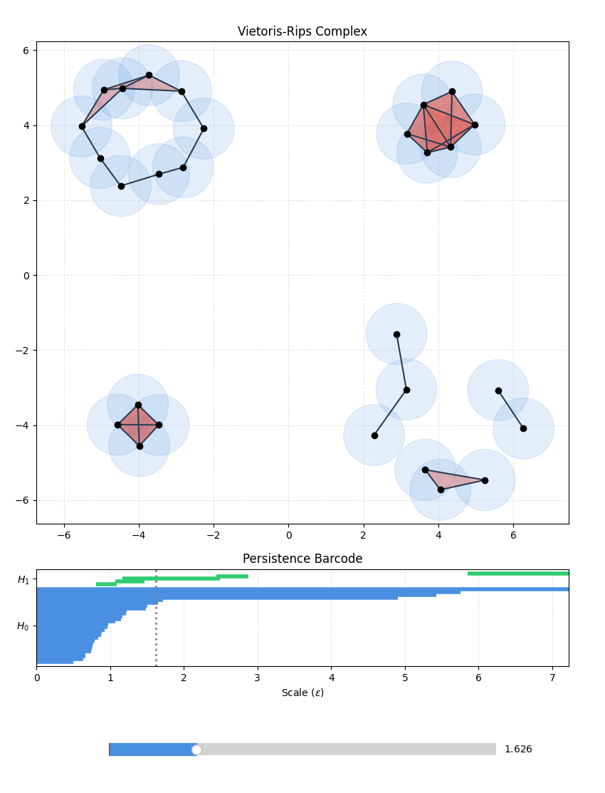
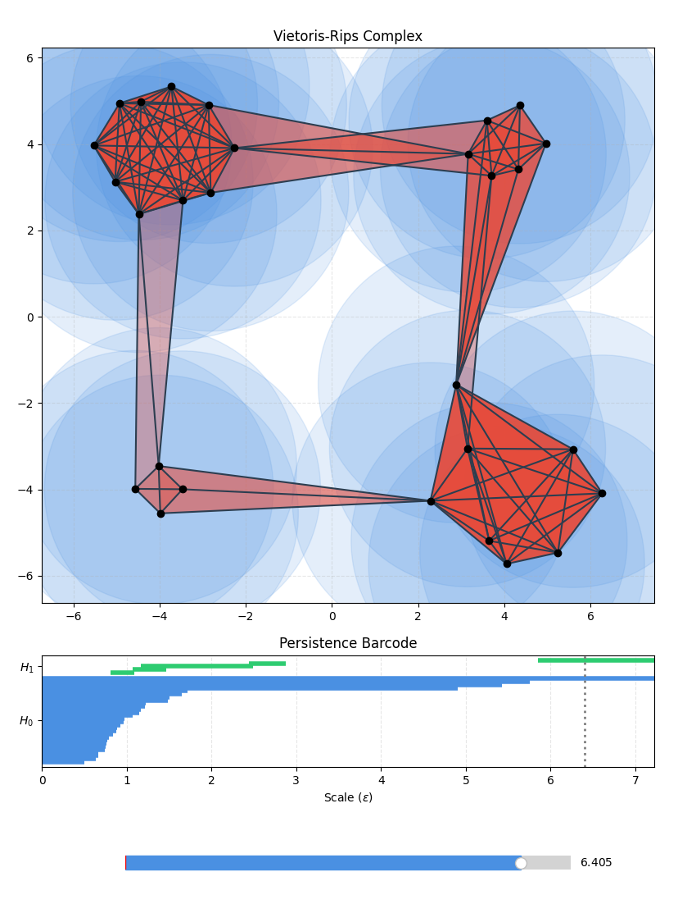

# Quantum Topological Data Analysis and Persistent Homology

This repository implements algorithms from classical and quantum topological data analysis. Implementations are for learning purposes, not efficiency.

**Classical Topological Data Analysis:** Starting from a point cloud, we construct a
Vietoris-Rips complex and the corresponding persistent homology, which give us the persistence
barcode. We also compute Betti numbers using the combinatorial Hodge-Laplacian, for comparison with the quantum approach.

**Quantum Topological Data Analysis:** We implement two approaches:

1. **LGZ approach:** We follow the main steps of the original [LGZ algorithm](https://arxiv.org/abs/1408.3106), using amplitude amplification to prepare simplex states and Quantum Phase Estimation to estimate Betti numbers. Our main implementation uses **sparse block encoding of the Dirac operator and a [qubitization walk](https://arxiv.org/abs/1610.06546)**, with oracles constructed from the threshold adjacency matrix. We also implement Trotterized evolution for testing and comparison.
2. **QBNE-Power:** We estimate normalized Betti numbers using Monte Carlo sampling, following [Algorithm 6 of arXiv:2408.16934](https://arxiv.org/abs/2408.16934). The circuit estimates moments of the reflected Laplacian using a fermionic representation of the Dirac operator and block encodings of the projectors.

The circuits are implemented and simulated using [pytket](https://docs.quantinuum.com/tket/api-docs/).

All classical and quantum-algorithm components are implemented for clarity, not optimized in any way.

## Contents

- [Contents](#contents)
- [Running the examples](#running-the-examples)
- [Classical Topological Data Analysis](#classical-topological-data-analysis)
  - [Persistent Homology](#persistent-homology)
  - [Combinatorial Hodge-Laplacian](#combinatorial-hodge-laplacian)
  - [Distance, threshold adjacency matrix and clique complex](#distance-threshold-adjacency-matrix-and-clique-complex)
- [Quantum Topological Data Analysis (LGZ approach)](#quantum-topological-data-analysis-lgz-approach)
  - [Simplex Encoding](#simplex-encoding)
  - [Main idea of the quantum algorithm](#main-idea-of-the-quantum-algorithm)
  - [Step one: Preparing the Simplex Mixture](#step-one-preparing-the-simplex-mixture)
  - [Step two: Quantum Phase Estimation](#step-two-quantum-phase-estimation)
    - [Sparse block encoding and Qubitization](#sparse-block-encoding-and-qubitization)
    - [Pauli decomposition and Trotterization](#pauli-decomposition-and-trotterization)
  - [Resource estimates](#resource-estimates)
- [QBNE-Power](#qbne-power)
  - [Main idea](#main-idea)
  - [Estimating the moment](#estimating-the-moment)
  - [Implementation and resources](#implementation-and-resources)
- [Appendix](#appendix)
  - [Sparse block encoding of the Dirac operator](#sparse-block-encoding-of-the-dirac-operator)
  - [Simplex membership oracle](#simplex-membership-oracle)
  - [QBNE-Power implementation](#qbne-power-implementation)
    - [Projector block encodings](#projector-block-encodings)
    - [Fermionic Dirac operator](#fermionic-dirac-operator)

## Running the examples

Install the numerical, plotting, and pytket/Qiskit dependencies:

~~~bash
python -m pip install numpy scipy matplotlib pytket-qiskit qiskit-aer tqdm
~~~

Run the examples as modules from the repository root folder.

The persistent-homology script computes the persistence barcode:

~~~bash
# Persistent homology over F_2 and an interactive barcode plot
python -m scripts.persistent_homology_barcode
~~~

<p align="center">
  
  
</p>

The Hodge-Laplacian script computes harmonic cycles and Betti numbers at different scales:

~~~bash
# Classical Hodge-Laplacian calculation at fixed scales
python -m scripts.classical_hodge_laplacian_betti
~~~

<!-- ~~~text
beta_1 = dim ker(L_1) = 2

zero mode 1 in the C_1(K_epsilon) basis
mode = -0.008|(3, 4)> +0.249|(14, 15)> -0.024|(8, 9)> -0.008|(2, 3)> +0.499|(11, 12)> -0.499|(10, 15)> +0.249|(12, 13)> -0.024|(6, 7)> -0.024|(1, 2)> -0.024|(5, 6)> +0.499|(10, 11)> -0.024|(7, 8)> -0.024|(4, 5)> -0.024|(0, 1)> +0.024|(0, 9)> +0.249|(13, 15)> -0.016|(2, 4)> +0.249|(12, 14)>

zero mode 2 in the C_1(K_epsilon) basis
mode = -0.113|(3, 4)> -0.018|(14, 15)> -0.339|(8, 9)> -0.113|(2, 3)> -0.036|(11, 12)> +0.036|(10, 15)> -0.018|(12, 13)> -0.339|(6, 7)> -0.339|(1, 2)> -0.339|(5, 6)> -0.036|(10, 11)> -0.339|(7, 8)> -0.339|(4, 5)> -0.339|(0, 1)> +0.339|(0, 9)> -0.018|(13, 15)> -0.226|(2, 4)> -0.018|(12, 14)>


epsilon -> beta_1(K_epsilon) = dim ker L_1(K_epsilon)

   epsilon   beta_1
--------------------
  0.000000        0
  1.067461        1
  1.172352        2
  1.469419        1
  2.486905        0
~~~ -->

The QTDA scripts estimate Betti numbers from simulated quantum circuits following the LGZ algorithm:

~~~bash
# QTDA Betti-number estimate with amplitude amplification, Trotterization, and QPE
python -m scripts.qtda_betti_estimation_trotter

# QTDA Betti-number estimate with amplitude amplification, sparse block encoding, and QPE on the qubitization walk
python -m scripts.qtda_betti_estimation_qubitization
~~~

The QBNE-Power script estimates Betti numbers using Monte Carlo sampling and compares with the exact classical value:

~~~bash
python -m scripts.qbne_power_betti_estimation
~~~

Example output:

~~~text
--- Quantum registers ---
S:       6 qubits  (simplex register)
W:       4 qubits  (shared work register)
a:       3 qubits  (flags a0, a1, a2)
total:   13 qubits

Tr(H^15)/|S_p| estimate = 0.293800
beta_1         estimate = 2.056600
beta_1                  = 2 (Exact value)
~~~

## Classical Topological Data Analysis

### Persistent Homology

We start from a point cloud from a dataset

```math
X=\lbrace x_0,\ldots,x_{n-1}\rbrace\subset\mathbb{R}^d.
```

At scale $\epsilon$, the Vietoris-Rips complex contains every simplex whose
points are pairwise within distance $\epsilon$:

```math
K_\epsilon=
\left\lbrace
\sigma\subseteq X \;\big|\;
d(x,y)\leq\epsilon,
\quad \forall x,y\in\sigma
\right\rbrace.
```

As $\epsilon$ increases, simplices are added but never removed, giving rise to a filtration $K_{\epsilon_0}\subseteq \cdots \subseteq K_{\epsilon_m}$.

A $p$-simplex $\sigma=[v_0,\ldots,v_p]\in K_\epsilon$ contains $p+1$
vertices: a vertex is a 0-simplex, an edge is a 1-simplex, and a triangle is a 2-simplex.
Let $`S_p(K_\epsilon)=\left\lbrace\sigma\in K_\epsilon\mid\dim\sigma=p\right\rbrace`$ denote the set of $p$-simplices.
The $p$-chain group is the $\mathbb F$-vector space spanned by these simplices: $`C_p(K_\epsilon)=\mathrm{span}_{\mathbb{F}}S_p(K_\epsilon)`$, with the boundary map $\partial_p:C_p\rightarrow C_{p-1}$

```math
\partial_p[v_0,\ldots,v_p]
=\sum_{r=0}^{p}(-1)^r
[v_0,\ldots,v_{r-1},v_{r+1},\ldots,v_p].
```

The $p$-th homology group is $`H_p(K_\epsilon)=\ker\partial_p / \mathrm{im}\,\partial_{p+1}`$ and its dimension is the $p$-th Betti number $\beta_p^{(\epsilon)}=\dim H_p(K_\epsilon)$.

The inclusion $\iota:K_{\epsilon_i}\hookrightarrow K_{\epsilon_j}$ induces a linear
map on homology,
$\iota_*:H_p(K_{\epsilon_i})\rightarrow H_p(K_{\epsilon_j})$. We can therefore
follow homology classes across the filtration: classes are born when they first
appear and die when they become trivial at a later scale.

The persistent homology group is
$H_p^{i\to j}=\mathrm{im}(\iota^{i\to j}_*)$, containing classes present at scale
$\epsilon_i$ that survive to $\epsilon_j$. Its dimension,

```math
\beta_p^{i\to j}=\dim H_p^{i\to j},
```

is the **persistent Betti number**.

#### Computing Persistent Homology
We use the standard reduction algorithm of [Zomorodian and Carlsson, *Computing Persistent Homology*](https://doi.org/10.1007/s00454-004-1146-y).

For computing persistent Betti numbers it's simplest to work over $\mathbb F = \mathbb F_2$. Define the global boundary matrix $D$ by $D_{ij} = \langle\sigma_i, \partial\sigma_j\rangle$. Over $\mathbb F_2$, this becomes

```math
D_{ij}=
\begin{cases}
1, & \sigma_i\text{ is a codimension-one face of }\sigma_j,\\
0, & \text{otherwise.}
\end{cases}
```

For persistent homology, we need to keep track of the distance at which each simplex enters the Vietoris-Rips complex. In the code we track this using

~~~python
FilteredSimplex(vertices=(0, 1, 3), distance=1.42)
~~~

We order the simplices in the order they appear in the complex: $\sigma_0,\sigma_1,\ldots,\sigma_m$. This gives a filtration $K_0\subseteq\cdots\subseteq K_m$, where one new simplex is
added at each step. In this basis:

```math
D=
\begin{array}{cc}
&
\begin{array}{ccccc}
\sigma_0 & \sigma_1 & \sigma_2 & \cdots & \sigma_m
\end{array}
\\
\begin{array}{c}
\sigma_0\\
\sigma_1\\
\sigma_2\\
\vdots\\
\sigma_m
\end{array}
&
\begin{pmatrix}
0 & * & * & \cdots & *\\
0 & 0 & * & \cdots & *\\
0 & 0 & 0 & \cdots & *\\
\vdots & \vdots & \vdots & \ddots & \vdots\\
0 & 0 & 0 & \cdots & 0
\end{pmatrix}
\end{array}.
```

We reduce the columns from left to right. If the lowest $1$ in column $j$
matches that of an earlier column $k\lt j$, we add the earlier column:

```math
R_j \leftarrow R_j + R_k,\qquad k\lt j.
```

This is addition modulo $2$, so it cancels the shared lowest $1$. We only use
earlier columns: they correspond to simplices already present when
$\sigma_j$ enters the filtration. A zero reduced column creates a homology
class; otherwise, its lowest $1$ identifies the earlier simplex whose class
is killed by $\sigma_j$. These birth--death pairs form the persistence
barcode.

### Combinatorial Hodge-Laplacian

For the Hodge-Laplacian and the quantum algorithm, we use real chain spaces ($\mathbb F=\mathbb R$)
with oriented simplices as an orthonormal basis. At a fixed scale $\epsilon$,
the $p$-th combinatorial Hodge-Laplacian is

```math
L_p
=\partial_p^\dagger\partial_p
+\partial_{p+1}\partial_{p+1}^\dagger,
\qquad
L_p:C_p\rightarrow C_p.
```

The vectors in $\ker L_p$ are the
harmonic $p$-chains and are unique representatives of homology classes. Hodge theory gives

```math
\ker L_p\cong H_p(K_\epsilon),
\qquad
\beta_p^{(\epsilon)}=\dim\,\ker\,L_p.
```

A useful operator in the quantum algorithm is the Dirac operator that
combines all boundary maps into one Hermitian operator on the graded chain
space $C=\bigoplus_p C_p$: $B=\partial+\partial^\dagger$.

```math
B=
\begin{pmatrix}
 & \partial_1 &  &  &  \\
\partial_1^\dagger &  & \partial_2 &  &  \\
 & \partial_2^\dagger &  & \ddots &  \\
 &  & \ddots &  & \partial_{n-1} \\
 &  &  & \partial_{n-1}^\dagger &
\end{pmatrix}.
```

Because $\partial^2=0$, its square is block diagonal, $B^2=\bigoplus_p L_p$.

If we are interested only in $L_p$, we only need the part of $B$ acting on
$C_{p-1}\oplus C_p\oplus C_{p+1}$:

```math
B_p=
\begin{pmatrix}
0 & \partial_p & 0\\
\partial_p^\dagger & 0 & \partial_{p+1}\\
0 & \partial_{p+1}^\dagger & 0
\end{pmatrix}.
```

Then its square restricted to $C_p$ is the Hodge-Laplacian,

```math
B_p^2|_{C_p}=L_p.
```


### Distance, threshold adjacency matrix and clique complex

The quantum algorithm estimates $\beta_p$ at a fixed scale $\epsilon$.
To construct its oracles, we only need the pairwise distance matrix and
the threshold adjacency matrix:

```math
D^{\mathrm{dist}}_{uv}=\|x_u-x_v\|,
\qquad
A_{uv}=\begin{cases}
1, & D^{\mathrm{dist}}_{uv}\leq\epsilon,\\
0, & \text{otherwise.}
\end{cases}
```

The Vietoris-Rips complex is the **clique complex** of the threshold graph:
a set of vertices forms a simplex exactly when every pair of distinct
vertices is connected in $A$. Thus $A$ describes the complex without
explicitly listing all its simplices. $D^{\mathrm{dist}}$ can be computed once, and reused
for different values of $\epsilon$.

For $n$ points in a fixed-dimensional space, $D^{\mathrm{dist}}$ and $A$ take $O(n^2)$ time to compute, with $O(n^2)$ storage for each matrix.

## Quantum Topological Data Analysis (LGZ approach)

### Simplex Encoding

Label the $n$ data points as $x_0,\ldots,x_{n-1}$ and use one qubit for each
point. A simplex $\sigma\subseteq X$ is encoded by its vertex bit string:

```math
|\sigma\rangle=|z_0z_1\ldots z_{n-1}\rangle,
\qquad
z_i=
\begin{cases}
1, & x_i\in\sigma,\\
0, & x_i\notin\sigma.
\end{cases}
```

A $p$-simplex has $p+1$ vertices, so its state has Hamming weight $p+1$. The
$n$-qubit Hilbert space decomposes into fixed-Hamming-weight
subspaces:

```math
\mathcal H=\bigoplus_p \mathcal H_p,
\qquad
\mathcal H_p
=\mathrm{span}\left\lbrace
|z\rangle \mid |z|=p+1
\right\rbrace.
```

At scale $\epsilon$, only
the $p$-simplices in $K_\epsilon$ are valid. They span the simplicial
subspace

```math
\mathcal H_{C_p}
=\mathrm{span}\left\lbrace
|\sigma\rangle \mid \sigma\in S_p(K_\epsilon)
\right\rbrace
\subseteq\mathcal H_p,
\qquad
\dim\mathcal H_{C_p}=\dim C_p(K_\epsilon)=|S_p(K_\epsilon)|.
```


### Main idea of the quantum algorithm
The goal is to estimate the dimension of the harmonic subspace,
$`\dim\,\ker\,L_p=\beta_p`$. First, construct the uniform mixed state over the
valid $p$-simplices:

```math
\rho_p
=\frac{1}{|S_p|}
\sum_{\sigma\in S_p}
|\sigma\rangle\langle\sigma|
=\frac{\Pi_{C_p}}{|S_p|},
```

where $\Pi_{C_p}$ is the projector onto $\mathcal H_{C_p}$. We then use QPE
with the Hermitian $B_p$ or $B$. Measuring the phase register decomposes the state
into its eigenspaces; on $\mathcal H_{C_p}$, the zero eigenspace is the
harmonic subspace $\ker L_p$.

If $\Pi_{\mathrm{harm},p}$ projects onto this subspace, the probability of a
zero-phase result is

```math
\Pr(\phi=0)
=\mathrm{Tr}(\Pi_{\mathrm{harm},p}\rho_p)
=\frac{\beta_p}{|S_p|}.
```

Thus, from $N$ QPE measurements with $N_0$ zero-phase outcomes,

```math
\beta_p\approx|S_p|\frac{N_0}{N}.
```

### Step one: Preparing the Simplex Mixture

We construct $\rho_p$ in three steps.

1. **Prepare the Dicke state.** The circuit $A_p$ prepares the uniform
   Hamming-weight-$`p+1`$ state

```math
A_p|0\cdots0\rangle=|u_p\rangle
=\frac{1}{\sqrt{\binom{n}{p+1}}}
\sum_{|z|=p+1}|z\rangle.
```


2. **Amplify $|S_p\rangle$.** We want to prepare the state

```math
|S_p\rangle
=\frac{1}{\sqrt{|S_p|}}
\sum_{\sigma\in S_p}|\sigma\rangle,
```

   however our current state decomposes as

```math
|u_p\rangle
=\sqrt{\zeta}\,|S_p\rangle
+\sqrt{1-\zeta}\,|S_p^\perp\rangle.
```

   We need to use Grover-like amplitude amplification to increase $\zeta$.
   The reflections and amplification operator are

```math
R_{C_p}|z\rangle
=(-1)^{\chi_{C_p}(z)}|z\rangle,
\qquad
R_{u_p}=2|u_p\rangle\langle u_p|-I,
\qquad
Q=R_{u_p}R_{C_p},
```

   where $\chi_{C_p}(z)=1$ when $|z\rangle$ encodes a simplex in $S_p$, and
   is $0$ otherwise. We can implement one of the reflections as $R_{u_p} = A_p(2|0\rangle\langle 0|-I)A_p^\dagger$, for $R_{C_p}$ see the appendix.

   After $r$ iterations,

```math
Q^rA_p|0\cdots0\rangle\approx|S_p\rangle.
```

   The initial good-state probability is $\zeta=\frac{|S_p|}{\binom{n}{p+1}}$, from which we estimate the number of iterations $r$.

3. **Create the mixed state.** Introduce a reference register in $|0\rangle_R^{\otimes n}$
   and apply CNOTs:

```math
|S_p\rangle_S|0\rangle_R^{\otimes n}
\longrightarrow
|\Phi_p\rangle_{SR}
=\frac{1}{\sqrt{|S_p|}}
\sum_{\sigma\in S_p}|\sigma\rangle_S|\sigma\rangle_R.
```

   Tracing out $R$ gives $\rho_p=\mathrm{Tr}_R(|\Phi_p\rangle\langle\Phi_p|)$.

### Step two: Quantum Phase Estimation

We next use QPE to identify the zero modes and estimate their probability, from which we obtain the Betti number. The Dirac operator $B$ is Hermitian but generally not unitary, so QPE cannot act on it directly. The [LGZ algorithm](https://arxiv.org/abs/1408.3106) proposes sparse Hamiltonian simulation. Here we implement two approaches:

1. **Sparse block encoding and qubitization.** We use this more modern approach to construct a unitary walk whose phases encode the eigenvalues of $B$, following [Low and Chuang](https://arxiv.org/abs/1610.06546).
2. **Pauli decomposition and Trotterization.** We also implement Trotterized evolution for testing and comparison purposes.

#### Sparse block encoding and Qubitization

We will block encode the full Dirac operator $B=\partial+\partial^\dagger$.
This operator only connects simplices $\langle\tau|\partial+\partial^\dagger|\sigma\rangle$ that differ by one vertex. So $B$ has at most $n$ nonzero entries per row or column: it is $O(n)$-sparse. Out of its $2^n\times 2^n=4^n$ components, at most $O(n2^n)$ elements are non-zero.

We will block encode $B$ using the sparse oracles from the threshold adjacency matrix $A$, which uses $O(n^2)$ storage, without constructing the full matrix $B$.

1. **Block encode $B$.** We construct a unitary $U_B$ that block encodes
   $B/\alpha$ on the valid-simplex subspace, adding $\lceil\log_2 n\rceil+1$
   ancilla qubits. Here $\alpha=2^{\lceil\log_2 n\rceil}$.
   Writing these ancillas as $\mathrm{anc}$, the zero-ancilla block is

```math
(I_S\otimes\langle0|_{\mathrm{anc}})U_B
(I_S\otimes|0\rangle_{\mathrm{anc}})=\frac{B}{\alpha}.
```

   See the [appendix](#sparse-block-encoding-of-the-dirac-operator) for the detailed construction.

2. **Construct the qubitization walk.** Our construction satisfies
   $U_B^2=I$. Reflecting about zero block ancillas gives

```math
W=(2P-I)U_B,
\qquad P=I_S\otimes|0\rangle\langle0|_{\mathrm{anc}}.
```

   For an eigenvalue $\lambda$ of $B$, the corresponding walk eigenvalues
   are $e^{\pm i\theta}$, where

```math
\cos\theta=\frac{\lambda}{\alpha}.
```

3. **Run QPE and count zero modes.** Apply QPE to $W$. A zero eigenvalue gives
   $\theta=\pi/2$, so the two QPE phases are $1/4$ and $3/4$.
   Since $B^2|_{C_p}=L_p$, these identify the harmonic $p$-chains.
   Ideally, the two phase probabilities satisfy

```math
P(\phi=1/4)+P(\phi=3/4)=\frac{\beta_p}{|S_p|}.
```

#### Pauli decomposition and Trotterization

Since we are not exploiting sparseness here, the code uses both $B_p$ and $L_p$. We will here show QPE with $L_p$:

1. **Embed $L_p$.** Classically, $L_p$ is a $|S_p|\times|S_p|$ matrix in the
   basis of valid $p$-simplices. QPE needs an operator on all $n$ qubits of the
   simplex register, so we embed it in the $2^n$-dimensional space:

```math
\widetilde L_{p,S}
=\sum_{\sigma_i,\sigma_j\in S_p}
(L_p)_{ij}|\sigma_i\rangle\langle\sigma_j|.
```

2. **Construct $U(t)$.** Decompose the embedded operator into Pauli strings,

```math
\widetilde L_{p,S}=\sum_\alpha c_\alpha P_\alpha,
\qquad
c_\alpha=\frac{1}{2^n}
\mathrm{Tr}(\widetilde L_{p,S}P_\alpha),
\qquad
P_\alpha\in\lbrace I,X,Y,Z\rbrace^{\otimes n},
```

   then construct its time evolution by Trotterization:

```math
U(t)=e^{-it\widetilde L_{p,S}}
\approx
(
\prod_\alpha e^{-i(t/r)c_\alpha P_\alpha}
)^r.
```

3. **Run QPE and count zero modes.** Apply QPE to $U(t)$ and measure the
   phase register. The harmonic states have eigenvalue $0$ and therefore give
   phase $0$. If $N_0$ of $N$ measurements give the all-zero phase,

```math
\beta_p\approx|S_p|\frac{N_0}{N}.
```

### Resource estimates

We will give some broad comments on resources needed, for the qubitization approach. A more detailed analysis of gate costs and comparison with classical methods will be added later.

#### Qubits

The simplex and reference registers each use $n$ qubits. For AA, the Membership oracle needs $h\le n$ violation qubits and one membership qubit. After AA, these qubits are used for the qubitization walk's $r+1$ ancillas, where $r=\lceil\log_2 n\rceil$. QPE adds $q$ phase qubits, for $q$-bits of accuracy.
Thus the total is $N_{\mathrm{qubits}}=2n+\max(h+1,r+1)+q$, or

```math
N_{\mathrm{qubits}}\le 3n+q+1.
```

The required QPE precision depends on the spectral gap of $B$. Zero modes correspond to phases $\phi_0=1/4$ and $3/4$. Let $\Delta=\min_{\lambda\ne0}|\lambda|$ be the smallest nonzero eigenvalue magnitude. For the closest nonzero eigenvalues $\lambda=\pm\Delta$, the separation from the nearest zero-mode phase is $\delta\phi=|\phi_0-\phi_\Delta|$, given by

```math
\delta\phi = \frac{\arcsin\left(\Delta/\alpha\right)}{2\pi} = \frac{\Delta}{2\pi\alpha} + O\left(\frac{\Delta}{\alpha}\right)^3.
```

We are mainly concerned with small $\Delta/\alpha$. For $q$ QPE qubits, the phase grid has spacing $2^{-q}$, so to have a fine enough grid to resolve the phase gap we need

```math
2^{-q} \leq \delta\phi\approx \frac{\Delta}{2\pi\alpha} \quad \Rightarrow\quad q\geq \log_2\left(\frac{2\pi\alpha}{\Delta}\right).
```

This estimates the resolution needed; tighter QPE error tolerances can require additional phase qubits.
For our block encoding we have $\alpha = O(n)$. Imagine a family of pointclouds, as we add more data. For fixed QPE error tolerance, if $\Delta$ is constant or the gap closes polynomially $\Delta\sim n^{-k}$, then $q = O(\log n)$. If the gap closes exponentially in $n$, then $q$ must scale with $n$ or higher.

#### Circuit cost

We count how often the main subroutines are called. This shows how the valid-simplex fraction, QPE precision, and number of measurements affect the cost.

1. **Prepare the mixture.** Apply $A_p$ once, then perform $k$ AA iterations. Each iteration uses $A_pR_0A_p^\dagger$ for the state reflection and $O_K^\dagger ZO_K$ for the good-state reflection. For a small valid-simplex fraction $\zeta=|S_p|/\binom{n}{p+1}$, standard AA needs $O(1/\sqrt{\zeta})$ iterations for constant success probability.

2. **Run QPE.** Apply controlled powers $W,W^2,\ldots,W^{2^{q-1}}$. In our implementation, these powers are built by repeating the walk, giving

```math
1+2+\cdots+2^{q-1}=2^q-1
```

   controlled walk calls per shot. The walk count grows exponentially in $q$, but is polynomial in $n$ when $q=O(\log n)$.

The main circuit calls per shot are therefore:

| Circuit | Calls per shot |
| --- | --- |
| Preparation $A_p$ or $A_p^\dagger$ | $2k+1$ |
| Membership oracle $O_K$ or $O_K^\dagger$ | $2k$ |
| Controlled walk $W$ | $2^q-1$ |


Repeating the circuit for $N$ measurements multiplies these counts by $N$. Thus rare valid simplices increase the AA cost, while a smaller normalized spectral gap requires more QPE precision and more walk calls.

## QBNE-Power

We will briefly describe QBNE-Power, a quantum algorithm for estimating normalized Betti numbers using Monte Carlo sampling, following [Algorithm 6 of arXiv:2408.16934](https://arxiv.org/abs/2408.16934).

### Main idea

At a fixed scale $\epsilon$, define the reflected Laplacian $H=I-\frac{L_p}{n}$. The eigenvalues of $L_p$ satisfy $0\leq\lambda\leq n$. The idea is to estimate

```math
\mu_d^{(p)}
=\frac{\mathrm{Tr}(H^d)}{|S_p|}
=\frac{\beta_p}{|S_p|}
+\frac{1}{|S_p|}\sum_{\lambda>0}
\left(1-\frac{\lambda}{n}\right)^d.
```
The contributions from positive eigenvalues decay as $d$ increases, thus

```math
\lim_{d\to\infty}\mu_d^{(p)}=\frac{\beta_p}{|S_p|}.
```

### Estimating the moment

The trace is a sum of diagonal elements in the valid $p$-simplex basis:

```math
\mu_d^{(p)}
=\frac{1}{|S_p|}\sum_{\sigma\in S_p}
\langle\sigma|H^d|\sigma\rangle.
```

We estimate this average by sampling $\sigma$ uniformly from $S_p$ and preparing $|\sigma\rangle$, effectively preparing the mixed state $\rho_p=\frac{1}{|S_p|}\sum_{\sigma\in S_p}|\sigma\rangle\langle\sigma|$.

The paper decomposes $H=D^\dagger D$ on the valid $p$-simplex subspace and uses a block encoding $U_D$:

```math
U_D|\sigma\rangle_S|0\rangle_{\mathrm{anc}}
=\left(D|\sigma\rangle_S\right)|0\rangle_{\mathrm{anc}}
+|\perp\rangle,
```
Measuring the ancillas in this state, gives $\mathrm{anc}=0$ with probability

```math
\Pr(\mathrm{anc}=0\mid\sigma)
=\|D|\sigma\rangle\|^2
=\langle\sigma|D^\dagger D|\sigma\rangle
=\langle\sigma|H|\sigma\rangle.
```

We call an all-zero ancilla outcome a success. If we apply $U_D$ and $U_D^\dagger$ alternately for $d$ steps, checking the ancillas after each application, the probability that all $d$ checks succeed is

```math
\Pr(\text{all }d\text{ checks succeed}\mid\sigma)
=\langle\sigma|H^d|\sigma\rangle.
```

This gives a Monte Carlo algorithm for estimating $\mu_d^{(p)}$:

1. Sample $\sigma\in S_p$ uniformly and prepare $|\sigma\rangle_S|0\rangle_{\mathrm{anc}}$.
2. Apply $U_D,U_D^\dagger,U_D,\ldots$ for $d$ steps. Measure then reset the success flags after each application.
3. Record $X_i=1$ if every check succeeds, and $X_i=0$ otherwise.
4. Repeat for $N$ samples.

Averaging over the sampled simplices

```math
\widehat\mu_d^{(p)}
=\frac{1}{N}\sum_{i=1}^{N}X_i
=\frac{N_{\mathrm{success}}}{N},
```

estimates $\mu_d^{(p)}$. For sufficiently large $d$, the positive-eigenvalue contributions are small, so this approximates $\beta_p/|S_p|$.

For additive estimation error $\epsilon$ and failure probability $\eta$, the paper shows that choosing

```math
d\geq\frac{\log(2/\epsilon)}{\delta},
\qquad
N\geq\frac{2\log(2/\eta)}{\epsilon^2}
```

guarantees

```math
\Pr\!\left(
\left|\widehat\mu_d^{(p)}-\frac{\beta_p}{|S_p|}\right|\leq\epsilon
\right)\geq 1-\eta.
```

Here $\delta$ is a positive lower bound on the normalized spectral gap of $L_p$: $0\lt\delta\lt\min_{\lambda>0}\lambda/n$. Thus the estimate is within $\epsilon$ of the true normalized Betti number with probability at least $1-\eta$. Each sample uses $d$ checks, giving $Nd$ calls to $U_D$ or $U_D^\dagger$ ([Theorem 6.2](https://arxiv.org/abs/2408.16934)).

### Implementation and resources

We construct a block encoding $U_D$ of

```math
D=(I-P_K)\frac{\widetilde B}{\sqrt n}P_KP_p,
```

where $\widetilde B$ is the unrestricted Dirac operator, $P_K$ is the projector onto the Vietoris-Rips complex $K_\epsilon$, and $P_p$ projects onto states with Hamming weight $|\sigma|=p+1$. Our implementation uses the registers

| Register | Meaning | Qubits |
| --- | --- | --- |
| $S$ | Simplex register | $n$ |
| $W$ | Shared work register | $w=\max(s,h)$ |
| $a$ | Three success flags $a_0,a_1,a_2$ | $3$ |

The unitary $\widetilde B/\sqrt n$ acts only on the simplex register $S$. The block encodings of the projectors share the work register $W$, but each records its result in a separate bit of the $a$-register. A check succeeds when $a_0a_1a_2=000$. Here $s=\lceil\log_2(n+1)\rceil$ is the Hamming-weight counter size, and $h\leq n-1$ is the number of membership work qubits.

See the [QBNE-Power implementation appendix](#qbne-power-implementation) for details of the projector block encodings and the fermionic Dirac circuit.

## Appendix

### Sparse block encoding of the Dirac operator

#### Matrix elements and registers

The Dirac operator $B$ only connects simplices that differ by one vertex. Thus $\langle\tau|B|\sigma\rangle$ can be nonzero only when $\tau=\sigma\oplus e_v$, where $e_v$ has a $1$ at position $v$ and zeros elsewhere. This adds vertex $v$ if $\sigma_v=0$ and removes it if $\sigma_v=1$. But even some of these components vanish, we can parametrize it as follows

```math
B_{\sigma\oplus e_v,\sigma}=\chi(\sigma,v)s(\sigma,v),
\qquad s(\sigma,v)=(-1)^{\sum_{u\lt v}\sigma_u}.
```

Here $\chi=0, 1$ checks whether the transition $\sigma\rightarrow\sigma\oplus e_v$ is allowed, and $s=\pm 1$ gives its
orientation. For block encoding we add ancilla registers to $S$, $|\sigma\rangle_S|v\rangle_V|a\rangle_a$:

| Register | Meaning | Qubits |
| --- | --- | --- |
| $S$ | Simplex label $\sigma$ | $n$ |
| $V$ | Vertex to toggle | $r=\lceil\log_2 n\rceil$ |
| $a$ | Zero or nonzero matrix-value flag | $1$ |

Here $|\sigma\rangle_S$ and $|v\rangle_V=|v_{r-1},\dots, v_0\rangle_V$ label the component $B_{\sigma\oplus e_v,\sigma}$, while the $a$-register will encode whether this is non-zero, $\chi(\sigma,v)$. The sign $s(\sigma,v)$ will be applied as a phase.

Note: we assume the state $|\sigma\rangle$ is a valid simplex and only check $\sigma\oplus e_v$.

#### Position and value oracles

We will use two oracles: the position and the value oracles

```math
O_P|\sigma,v,a\rangle=|\sigma\oplus e_v,v,a\rangle,
\qquad
O_B|\sigma,v,a\rangle
=s(\sigma,v)|\sigma,v,a\oplus\chi(\sigma,v)\rangle.
```

For unused vertex labels $v\geq n$, both oracles act as identity.

#### Constructing the block encoding

Prepare the vertex register uniformly with Hadamards, then apply
$`\mathrm{SELECT}_B`$ and undo the preparation:

```math
\mathrm{SELECT}_B=O_PX_aO_B,
```

For $v\lt n$, it acts as

```math
\mathrm{SELECT}_B|\sigma,v,a\rangle
=s(\sigma,v)\,|\sigma\oplus e_v,\, v,\, a\oplus 1\oplus\chi(\sigma,v)\rangle.
```

Thus allowed transitions have $a=0$, and disallowed transitions have
$a=1$. The block encoding is then defined as

```math
U_B=H_V^{\otimes r}\,\mathrm{SELECT}_B\,H_V^{\otimes r}.
```

One can then readily check that

```math
U_B|\sigma,0,0\rangle_{SVa}
=\left(\frac{B}{\alpha}|\sigma\rangle_S\right)|0,0\rangle_{Va} + |\perp\rangle_{SVa},
\qquad \alpha=2^r = O(n).
```

Giving us the desired block encoding. Importantly, we have that $U_B^2=I$ which is useful for constructing the qubitization walk.

#### Linear Combination of Unitaries (LCU) interpretation

There is a nice way to interpret the above in terms of LCU's, clarifying the need of the two different ancilla registers $V$ and $a$. The Dirac operator can be written as $B = \sum_v B_v$ where

```math
B_v|\sigma\rangle = \chi(\sigma, v)s(\sigma, v)|\sigma\oplus e_v\rangle.
```

This makes $B$ look like a LCU, however $B_v$ is not unitary since $\chi$ can vanish. In order to make $B_v$ unitary, we can add the $|\cdot\rangle_a$ register and define

```math
U_v|\sigma, a\rangle_{Sa} = s(\sigma, v)\,|\sigma\oplus e_v,\,a\oplus 1\oplus\chi(\sigma, v)\rangle_{Sa}.
```

Which is a block encoding: ${}_a\langle 0|U_v|0\rangle_a = B_v$. This first step turns $B\rightarrow \sum_v U_v$ into an LCU. We can thus block encode this using the standard LCU construction, adding the $V$ register:

```math
U_B=\mathrm{PREPARE}_V^\dagger\cdot\mathrm{SELECT}_B\cdot\mathrm{PREPARE}_V,
```

where $\mathrm{PREPARE}_V = H^{\otimes r}_V$.

#### Implementing the oracles from the threshold graph
What is remaining now, is to construct the quantum circuits for the position $O_P$ and value $O_B$ oracles.

##### Position oracle $O_P$

For convenience, write $C_{\mathrm{condition}}X_t$ and $C_{\mathrm{condition}}Z_t$ for
generalized controlled gates: apply $X$ or $Z$ to target $t$ only when
the controls match the stated pattern of zeros and ones.
These are implemented by `flip_if` and `phase_if` in
[control_gates.py](qtda/control_gates.py).

To obtain $\sigma\oplus e_v$, flip the $v$'th qubit in the S-register, $\sigma_v\rightarrow \sigma_v\oplus 1$, only when the vertex register is in the state $|v\rangle$. Thus

```math
O_P=\prod_{v=0}^{n-1}C_{V=v}X_{S_v}
```

##### Value oracle $O_B$

We consider $\chi(\sigma,v)$ and $s(\sigma,v)$ separately: $O_\chi$
computes $\chi$ in the flag $a$, while $O_s$ applies the sign as a phase.

**Compute $\chi$.** The indicator $\chi(\sigma,v)$ is $1$ iff
$\langle\sigma\oplus e_v|B|\sigma\rangle$ is nonzero.
For each vertex $v$, define the vertices incompatible with it:

```math
F_v=\lbrace u\ne v \mid A_{vu}=0\rbrace.
```

For $\sigma\oplus e_v$ to be valid, assuming $\sigma$ is valid, we need
$\sigma_u=0$ for every $u\in F_v$. This checks compatibility when adding
$v$. However, when removing $v$ the condition already holds, since we assume $\sigma$ is valid. This gives us the first factor in

```math
\chi(\sigma,v)=
\left[\prod_{u\in F_v}(1-\sigma_u)\right]
\left[1-\prod_{u\ne v}(1-\sigma_u)\right].
```

The second factor requires at least one vertex besides $v$. This excludes the empty-simplex transition since $\partial_0=\partial_0^\dagger=0$.

We can readily implement this in a circuit as

```math
O_\chi=\prod_{v=0}^{n-1}
\left(C_{V=v,\,S_{F_v}=0}X_a\right)
\left(C_{V=v,\,S_{\lbrace u \mid u\ne v\rbrace}=0}X_a\right),
```

where $S_T$ denotes the $S$-register qubits for vertices in $T$, so $S_T=0$ means $\sigma_v = 0$ for all $v\in T$.

**Apply $s$.** The orientation is

```math
s(\sigma,v)=(-1)^{\sum_{u\lt v}\sigma_u}
=\prod_{u\lt v}(-1)^{\sigma_u}.
```

For each $v$, apply $Z$ to every $S_u$ with $u\lt v$, controlled on $V=v$.
Each occupied vertex $u\lt v$ contributes a minus sign

```math
O_s=\prod_{v=0}^{n-1}\prod_{u\lt v}C_{V=v}Z_{S_u}.
```

Combining the two parts, we get the value oracle

```math
O_B=O_sO_\chi.
```

### Simplex membership oracle

For amplitude amplification, we need a good state reflection circuit. So a unitary that reflects valid $p$-simplex states: $R_{C_p}|\sigma\rangle=(-1)^{\chi_{C_p}(\sigma)}|\sigma\rangle$. The Dicke state already restricts $\sigma$ to Hamming weight $p+1$. A Vietoris–Rips simplex is valid iff every pair of occupied vertices is an edge or equivalently iff it contains no invalid edge. Define the set of nonedges (invalid edges)

```math
\mathcal N=\lbrace(i,j) \mid i\lt j,\ A_{ij}=0\rbrace.
```

For a given $\sigma$, the condition $\sigma_i\land\sigma_j$ checks whether the $(i,j)$ edge is present or not. We must then make sure all non-edges are not present:

```math
\chi_{C_p}(\sigma)=\bigwedge_{(i,j)\in\mathcal N}
\neg(\sigma_i\land\sigma_j).
```

We can compute this in a unitary circuit. For a given matrix $A$, we need $m=|\mathcal N|$ ancillas to check every non-edge condition $v_{ij}=\sigma_i\land\sigma_j$, and one ancilla to encode the result $\chi_{C_p}(\sigma)$:

```math
O_K|\sigma\rangle|0\rangle^{\otimes m}|b\rangle
=|\sigma\rangle|0\rangle^{\otimes m}|b\oplus\chi_{C_p}(\sigma)\rangle.
```

The circuit thus (1) computes the $m$ violation bits, (2) checks that they are all $0$ and (3) uncomputes violation bits (see [simplex_reflection.py](qtda/simplex_reflection.py)). Finally, compute membership, apply $Z$ to $b$, and uncompute: $R_{C_p}=O_K^\dagger(I\otimes Z_b)O_K$.

This approach gives us $m+1$ ancillas, which at worst can be $O(n^2)$. We can actually do better. For each $i=0, \cdots, n-1$, compute

```math
\mathcal N_i=\lbrace j \mid j>i,\ A_{ij}=0\rbrace.
```

If $\sigma_i=1$, then for all $j\in\mathcal N_i$ we must have $\sigma_j=0$ for a valid simplex. We can thus compute the membership indicator as

```math
t_i=\bigvee_{j\in\mathcal N_i}\sigma_i\land\sigma_j,
\qquad
\chi_{C_p}(\sigma)=\bigwedge_i\neg t_i.
```

This approach needs at most $n$ violation bits and one membership qubit, giving $O(n)$ ancillas

### QBNE-Power implementation

#### Projector block encodings

##### Membership projectors

For $P_K$, we reuse our membership oracle $O_K$. The projectors $P_K$ and $I-P_K$ can then be block encoded as

```math
U_{P_K}=X_aO_K,
\qquad
U_{I-P_K}=O_K.
```

From the definition of $O_K$, one can check that

```math
{}_{Wa}\langle0,0|U_{P_K}|0,0\rangle_{Wa}=P_K,
\qquad
{}_{Wa}\langle0,0|U_{I-P_K}|0,0\rangle_{Wa}=I-P_K.
```

##### Hamming-weight projector

We follow the Fourier counting approach described in [Appendix B of arXiv:2209.09371](https://arxiv.org/abs/2209.09371).

The projector $P_p$ selects states with Hamming weight $|\sigma|=p+1$. First, we will construct a unitary

```math
U_{\mathrm{ham}}|\sigma\rangle_S|0\rangle_C
=|\sigma\rangle_S\bigl||\sigma|\bigr\rangle_C.
```

that computes the Hamming weight in a counter register $C$ of size $s=\lceil\log_2(n+1)\rceil$.

Define the gate $R|y\rangle_C=e^{2\pi i y/2^s}|y\rangle_C$. Then one can readily check that

```math
\mathrm{QFT}_C^\dagger\cdot R_C\cdot\mathrm{QFT}_C|c\rangle_C
=|c+1\rangle_C.
```

So we can compute the Hamming weight of $|\sigma\rangle$ by applying controlled $R_C$ for every vertex:

```math
U_{\mathrm{ham}}
=\mathrm{QFT}_C^\dagger\cdot
\left(\prod_{v=0}^{n-1}C_{S_v=1}(R_C)\right)
\cdot\mathrm{QFT}_C.
```

We can now block encode the projector

```math
U_{P_p}|\sigma\rangle_S|0\rangle_C|0\rangle_a
=|\sigma\rangle_S|0\rangle_C
|1\oplus\delta_{|\sigma|,p+1}\rangle_a.
```

Compute the weight, flip $a$ when $C=p+1$, and undo the counting. Finally, apply $X_a$ so that flag $0$ means success:

```math
U_{P_p}
=X_aU_{\mathrm{ham}}^\dagger
\left(C_{C=p+1}X_a\right)U_{\mathrm{ham}},
```

The Hamming-weight projector is implemented in [qbne/projectors.py](qbne/projectors.py), using [quantum_algorithms/hamming_weight.py](quantum_algorithms/hamming_weight.py) for $U_{\mathrm{ham}}$.

#### Fermionic Dirac operator

We follow the fermionic representation and circuit construction in [arXiv:2201.11510](https://arxiv.org/abs/2201.11510v2). The unrestricted Dirac operator can be written in terms of fermionic annihilation and creation operators:

```math
\widetilde B=\sum_{v=0}^{n-1}(f_v+f_v^\dagger)
=\sum_{v=0}^{n-1}C_v.
```

Using the Jordan–Wigner representation,

```math
f_v=Z_0\cdots Z_{v-1}\frac{X_v+iY_v}{2},
\qquad
C_v=f_v+f_v^\dagger=Z_0\cdots Z_{v-1}X_v.
```

Note that $C_0=X_0$.

The operators $C_v$ are Hermitian, square to $I$ and pairwise anticommute. Thus $\widetilde B$ is Hermitian and $\widetilde B^2=nI$, so $\widetilde B/\sqrt n$ is Hermitian and unitary.

We implement it using

```math
\frac{\widetilde B}{\sqrt n}=R^\dagger X_0R,
\qquad
R=R_0(\theta_0)\cdots R_{n-2}(\theta_{n-2}),
```

where

```math
R_v(\theta_v)=e^{\theta_v C_vC_{v+1}/2}
=e^{-i\theta_v Y_vX_{v+1}/2},
\qquad
\theta_v=\arctan\!\left(\sqrt{n-v-1}\right).
```

To construct $R$, apply $R_{n-2}$ first and $R_0$ last. The full circuit applies $R$, then $X_0$, then $R^\dagger$, acting only on $S$. This is implemented in [qbne/dirac.py](qbne/dirac.py).
